<!DOCTYPE html>
<html lang="en">
<head>
    <meta charset="UTF-8">
    <meta name="viewport" content="width=device-width, initial-scale=1.0">
    <title>Dimitris Panagiotakopoulos | Academic Profile</title>
    
</head>
<body>
    <header>
        <h1>Dimitris Panagiotakopoulos</h1>
        

            PHD CANDIDATE
            //
            UNIVERSITY OF WEST ATTICA
            //
            ATHENS, GREECE
        

        

            <a href="mailto:dpanagiotakopoulos@uniwa.gr">dpanagiotakopoulos@uniwa.gr</a> | 
            <a href="https://scholar.google.com/citations?user=KTVlHPwAAAAJ&hl=en" target="_blank">Google Scholar</a> | 
            <a href="https://orcid.org/0000-0001-7087-772X" target="_blank">ORCID</a>
        

        
        

            <button class="btn-ctrl" id="lang-btn">GR</button>
            <button class="btn-ctrl" id="theme-btn" aria-label="Toggle Theme">
                <svg class="icon" viewBox="0 0 24 24"><path d="M12 2.25a.75.75 0 01.75.75v2.25a.75.75 0 01-1.5 0V3a.75.75 0 01.75-.75zM7.5 12a4.5 4.5 0 119 0 4.5 4.5 0 01-9 0zM18.894 6.166a.75.75 0 00-1.06-1.06l-1.591 1.59a.75.75 0 101.06 1.061l1.591-1.59zM21.75 12a.75.75 0 01-.75.75h-2.25a.75.75 0 010-1.5H21a.75.75 0 01.75.75zM17.834 18.894a.75.75 0 001.06-1.06l-1.59-1.591a.75.75 0 10-1.061 1.06l1.59 1.591zM12 18a.75.75 0 01.75.75V21a.75.75 0 01-1.5 0v-2.25A.75.75 0 0112 18zM7.758 17.303a.75.75 0 00-1.061-1.06l-1.591 1.59a.75.75 0 001.06 1.061l1.591-1.59zM6 12a.75.75 0 01-.75.75H3a.75.75 0 010-1.5h2.25A.75.75 0 016 12zM6.697 7.757a.75.75 0 001.06-1.06l-1.59-1.591a.75.75 0 00-1.061 1.06l1.59 1.591z" /></svg>
            </button>
        

    </header>
    <nav>
        <a href="#about" class="nav-item" id="nav-1">About</a>
        <a href="#phd" class="nav-item" id="nav-2">Dissertation</a>
        <a href="#education" class="nav-item" id="nav-3">Education</a>
        <a href="#themes" class="nav-item" id="nav-4">Research Themes</a>
        <a href="#art" class="nav-item" id="nav-art">Art Portfolio</a>
        <a href="#projects" class="nav-item" id="nav-prj">Funded Projects</a>
        <a href="#publications" class="nav-item" id="nav-5">Publications</a>
        <a href="#activity" class="nav-item" id="nav-6">Activity</a>
        <a href="#contact" class="nav-item" id="nav-7">Contact</a>
    </nav>
    <main>
        <section id="about">
            01 // PROFILE
            

                

                    

                        Dimitris Panagiotakopoulos is a Ph.D. Candidate and member of the "Design, Interior Architecture & Audiovisual Documentation" research laboratory at the University of West Attica, where he also serves as an Academic Fellow (Teaching Assistant).
                    

                    

                        His research interests lie within the broader scope of multimedia science, focusing on interaction design and the production process. His doctoral thesis specifically explores <strong>Digital Scent Technology</strong> within the Metaverse, investigating how multisensory interfaces can enhance user experience.
                    

                    

                        He has worked at the European Commission (DG DIGIT) in Brussels, and previously served as an editor and producer for television advertisements in the private sector in Milan, Italy. His background in Digital Humanities was established through internships at the University of Bologna (Department of History and Culture)—where he participated in the "BYZART" European research project—and the Ephorate of Palaeoanthropology and Speleology of the Hellenic Ministry of Culture.
                    

                    

                        His academic background combines creative arts with advanced technology. He holds an Integrated Master in Audio Visual Arts from the Ionian University and an MSc in "Intelligent Packaging: New Technologies and Marketing" from the University of West Attica. Additionally, he attended the Master of Fine Arts (MFA) program at Cardiff Metropolitan University via the Erasmus+ program. He also holds a Certificate of Pedagogical and Teaching Competence, fully qualifying him to teach Art subjects in Primary and Secondary Education.
                    

                

                

                    
                

            

        </section>
        <section id="phd">
            02 // PHD DISSERTATION
            

                

                    <svg viewBox="0 0 400 300" width="100%" height="100%" preserveAspectRatio="xMidYMid slice">
                        <defs>
                            <pattern id="grid-pattern" width="40" height="40" patternUnits="userSpaceOnUse">
                                <path d="M 40 0 L 0 0 0 40" fill="none" stroke="#222" stroke-width="1"/>
                            </pattern>
                            <radialGradient id="sensor-glow" cx="50%" cy="50%" r="50%" fx="50%" fy="50%">
                                <stop offset="0%" stop-color="#4d4dff" stop-opacity="0.8"/>
                                <stop offset="100%" stop-color="#000" stop-opacity="0"/>
                            </radialGradient>
                            <linearGradient id="scent-trail" x1="0%" y1="100%" x2="0%" y2="0%">
                                <stop offset="0%" stop-color="#fff" stop-opacity="0"/>
                                <stop offset="50%" stop-color="#fff" stop-opacity="0.8"/>
                                <stop offset="100%" stop-color="#4d4dff" stop-opacity="1"/>
                            </linearGradient>
                        </defs>
                        <rect width="100%" height="100%" fill="url(#grid-pattern)" opacity="0.6" />
                        <g transform="translate(200, 150)">
                            <circle r="10" fill="none" stroke="#4d4dff" stroke-width="1" opacity="0">
                                <animate attributeName="r" values="30;120" dur="4s" repeatCount="indefinite" />
                                <animate attributeName="opacity" values="0.6;0" dur="4s" repeatCount="indefinite" />
                            </circle>
                            <circle r="10" fill="none" stroke="#4d4dff" stroke-width="1" opacity="0">
                                <animate attributeName="r" values="30;120" dur="4s" repeatCount="indefinite" begin="2s"/>
                                <animate attributeName="opacity" values="0.6;0" dur="4s" repeatCount="indefinite" begin="2s"/>
                            </circle>
                            <circle cx="0" cy="0" r="30" fill="none" stroke="#fff" stroke-width="2" class="sensor-ring"/>
                            <circle cx="0" cy="0" r="8" fill="#4d4dff" class="sensor-core">
                                <animate attributeName="opacity" values="0.5;1;0.5" dur="2s" repeatCount="indefinite"/>
                            </circle>
                            <circle r="3" fill="url(#scent-trail)" opacity="0">
                                <animateMotion path="M -80 100 Q -40 50 0 0" dur="3s" repeatCount="indefinite" />
                                <animate attributeName="opacity" values="0;1;0" dur="3s" repeatCount="indefinite" />
                            </circle>
                            <circle r="3" fill="url(#scent-trail)" opacity="0">
                                <animateMotion path="M 80 100 Q 40 50 0 0" dur="3.5s" repeatCount="indefinite" begin="0.5s"/>
                                <animate attributeName="opacity" values="0;1;0" dur="3.5s" repeatCount="indefinite" begin="0.5s"/>
                            </circle>
                            <circle r="2" fill="#fff" opacity="0">
                                <animateMotion path="M 0 120 L 0 0" dur="2.5s" repeatCount="indefinite" begin="1s"/>
                                <animate attributeName="opacity" values="0;1;0" dur="2.5s" repeatCount="indefinite" begin="1s"/>
                            </circle>
                        </g>
                    </svg>
                

                

                    <h2 id="txt-phd-title">Olfactory Metaverse Experience Design</h2>
                    

                        "But when from a long-distant past nothing subsists... taste and smell alone... bear unfaltering... the vast structure of recollection." — Marcel Proust
                    

                

            

            

                

                    <svg class="phd-icon" viewBox="0 0 24 24" fill="none" stroke="currentColor" stroke-width="1.5"><line x1="2" y1="12" x2="22" y2="12" stroke-dasharray="4 2"></line><circle cx="18" cy="12" r="3"></circle></svg>
                    <h4 class="mono" id="txt-phd-c1-t">THE SHIFT</h4>
                    
Transitioning from <strong>Techno-anosmia</strong> to the <strong>3rd Wave</strong> of digital scent, driven by Perceptual Engineering.

                

                

                    <svg class="phd-icon" viewBox="0 0 24 24" fill="none" stroke="currentColor" stroke-width="1.5"><circle cx="8" cy="12" r="6"></circle><circle cx="16" cy="12" r="6"></circle></svg>
                    <h4 class="mono" id="txt-phd-c2-t">THE THEORY</h4>
                    
Defining <strong>Liminal Interaction</strong>: Scent as a connective tissue for <strong>Co-Reality</strong> between physical and digital worlds.

                

                

                    <svg class="phd-icon" viewBox="0 0 24 24" fill="none" stroke="currentColor" stroke-width="1.5"><path d="M12 2L2 7l10 5 10-5-10-5zM2 17l10 5 10-5M2 12l10 5 10-5"></path></svg>
                    <h4 class="mono" id="txt-phd-c3-t">INNOVATION</h4>
                    
Introducing the <strong>OloMET Framework</strong> and the <strong>Spatial Scent GUI</strong> for 3D olfactory diffusion control.

                

                

                    <svg class="phd-icon" viewBox="0 0 24 24" fill="none" stroke="currentColor" stroke-width="1.5"><path d="M12 22s8-4 8-10V5l-8-3-8 3v7c0 6 8 10 8 10z"></path></svg>
                    <h4 class="mono" id="txt-phd-c4-t">ETHICS</h4>
                    
Proposal for a <strong>Ethical Design Framework</strong> for Neurorights, covering the legal gap in mental privacy.

                

            

        </section>
        <section id="education">
            03 // EDUCATION
            

                
2020 - 2026

                

                    Ph.D. Candidate (8 EQF)
                    Dept. of Graphic Design & Visual Communication, University of West Attica. <strong>Thesis:</strong> "Digital Scent Technology in Metaverse Environments"
                

            

            

                
2023

                

                    Special Pedagogy Certification of Teaching Proficiency
                    Ionian University.
                

            
 
            

                
2018 - 2020

                

                    MSc in Intelligent Packaging: New Technologies & Marketing
                    University of West Attica (90 ECTS, 7 EQF).
                

            

            

                
2011 - 2017

                

                    Integrated Master in Audio Visual Arts
                    Ionian University (300 ECTS, 7 EQF).
                

            

            

                
2015

                

                    Erasmus+ (Master of Fine Arts Module)
                    Cardiff Metropolitan University.
                

            

        </section>
        <section id="awards">
            04 // AWARDS & SCHOLARSHIPS
            

                
2023

                

                    Most Popular Article Award
                    Awarded by <em>IEEE IT Professional</em> for the article "Digital Scent Technology Toward the Internet of Senses and the Metaverse".
                

            

            

                
2019 - 2024

                

                    Doctorate Scholarship
                    Special Account for Research Funds (ELKE), University of West Attica.
                

            

            

                
2016

                

                    Erasmus+ Scholarship for Traineeship
                    University of Bologna, Italy (Digital Humanities).
                

            

            

                
2015

                

                    Erasmus+ Scholarship for Studies
                    Cardiff Metropolitan University, UK (Master of Fine Arts).
                

            

        </section>
        <section id="teaching">
            05 // TEACHING EXPERIENCE
            

                
2020 - Pres.

                

                    Teaching Assistant (Academic Fellow)
                    University of West Attica. Courses: 1) <em>Multimedia Graphic Design</em>, 2) <em>Digital Interactive Multimedia Applications</em>
                

            

            

                
2020 - Pres.

                

                    Mentoring & Thesis Supervision
                    Master thesis Co-Supervisions & Mentoring programme, University of West Attica.
                

            

        </section>
        <section id="mobility">
            06 // INTERNATIONAL MOBILITY
            

                

                    

                        
2025

                        

                            Erasmus+ ICM – Visiting PhD Researcher
                            Technical University of Moldova (UTM), Chișinău.
                        

                    

                

                

                    
                

            

        </section>
        <section id="themes">
            07 // RESEARCH THEMES & CASE STUDIES
            

                

                    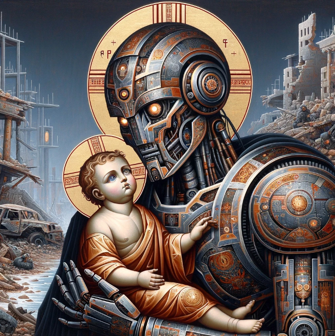
                    

                        [ART / AI / THEOLOGY]
                        <h3 class="p-title" id="pj-1-t">Sacred Futurism</h3>
                        

                            The project presents a series of artworks and their analysis under the theme of Sacred Futurism. It explores the contrast between the sacred and technology by depicting robots in the roles of traditional holy figures, rendered in a Byzantine style. Set against post-apocalyptic landscapes, the works address ecological destruction while suggesting that, in a dystopian future, robots may rebuild society based on ethical values and the protection of life. The analysis examines the relationship between religion, the metaverse, robotics, and artificial intelligence, discussing concepts such as transhumanism and "Robot Theology."
                        

                        →
                    

                

                

                    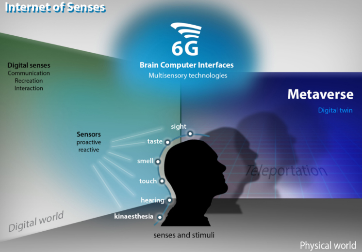
                    

                        [HCI / REVIEW]
                        <h3 class="p-title" id="pj-2-t">Digital Scent Technology & IoS</h3>
                        
Exploring multisensory interface technologies for HCI, focusing on digital scent. Reviews current electrical interfaces, chemical odor delivery, and the commercial potential of the Internet of Senses (IoS) and 6G infrastructure.

                        →
                    

                

                

                    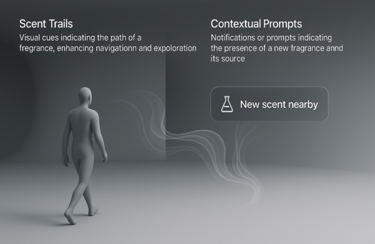
                    

                        [UX / PROTOTYPE]
                        <h3 class="p-title" id="pj-3-t">Spatial User Interfaces</h3>
                        
Developing 3D controls for olfactory diffusion in immersive environments. The project addresses the lack of visual tools for designing scent in the Metaverse.

                        →
                    

                

                

                    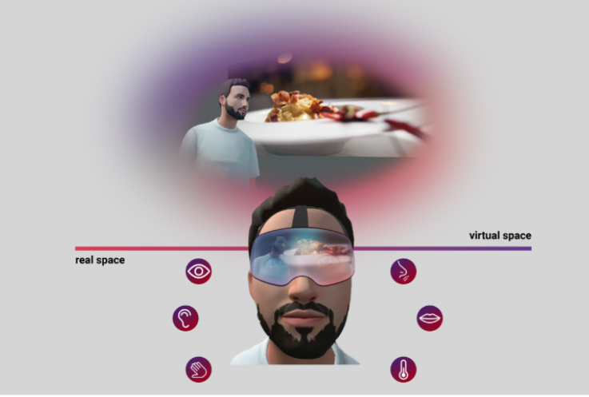
                    

                        [VR / PUBLIC SECTOR]
                        <h3 class="p-title" id="pj-4-t">METAVERSE in Public Sector</h3>
                        
Examining the application of Virtual Reality in the public sector. Explores sensory enhancement (haptic, auditory, olfactory) to create immersive experiences.

                        →
                    

                

                

                    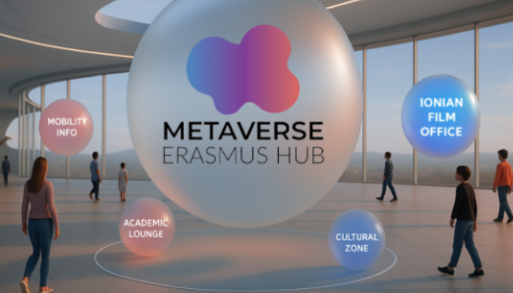
                    

                        [METAVERSE / EU]
                        <h3 class="p-title" id="pj-5-t">Metaverse Erasmus Hub</h3>
                        
A proposal to the European Commission for integrating metaverse technologies into Erasmus+. Enhances physical mobility via AI avatars.

                        →
                    

                

                

                    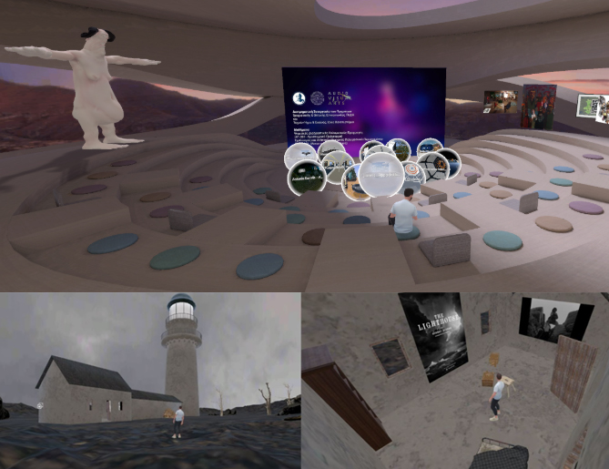
                    

                        [CASE STUDY]
                        <h3 class="p-title" id="pj-6-t">Metaverse in Education</h3>
                        
Case study with 20 students using Spatial. Findings indicate increased creativity (50%) and interest in technology integration (70%).

                        →
                    

                

                

                    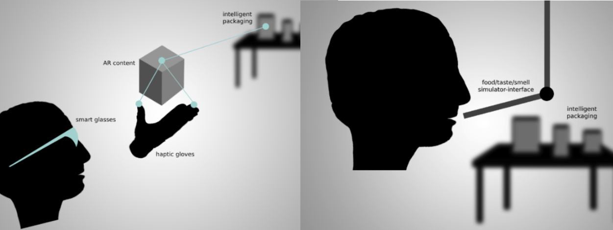
                    

                        [IOT / TOURISM]
                        <h3 class="p-title" id="pj-7-t">INTELLIGENT Packaging</h3>
                        
Exploring smart packaging as a key trend in tourism, blending physical and digital worlds via IoT, 5G, RFID, and NFC.

                        →
                    

                

                

                    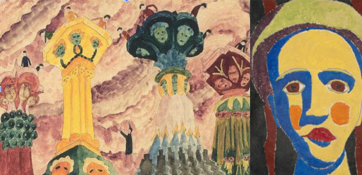
                    

                        [VR / PSYCHOLOGY]
                        <h3 class="p-title" id="pj-8-t">Prinzhorn Collection & VR</h3>
                        
Study on psychiatric artworks (Heidelberg) to explore emotion elicitation and simulate psychosis in VR environments.

                        →
                    

                

                

                    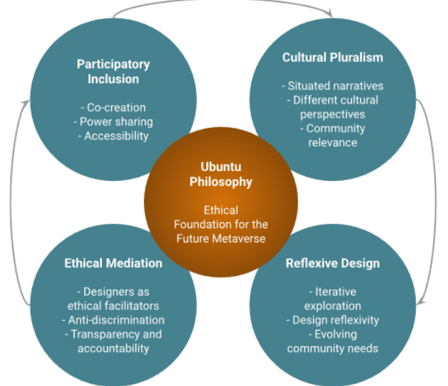
                    

                        [ETHICS / 5IR]
                        <h3 class="p-title" id="pj-9-t">ETHICAL METAVERSE</h3>
                        
Participatory Design (PD) as an ethical necessity for building an inclusive Metaverse. Rooted in the philosophy of Ubuntu.

                        →
                    

                

                

                    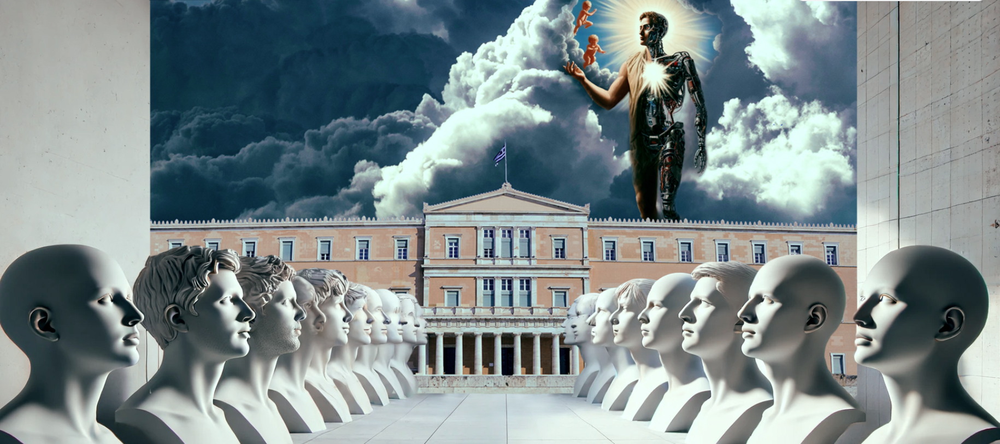
                    

                        [HYPERTEXT / LITERATURE / ART]
                        <h3 class="p-title" id="pj-10-t">KAFKAESQUE LABYRINTH</h3>
                        

                            Through an innovative educational approach to Kafka's work, hypertext fiction practices are employed. In search of the thread of interpretation, thoughts, experiences, and reflections are transformed into a creative artistic response. The interpretative process emerges as a field where art and technology intersect.    @ Panagiotakopoulos / Hyper-Kafka Memory Rooms
                        

                        →
                    

                

                

                    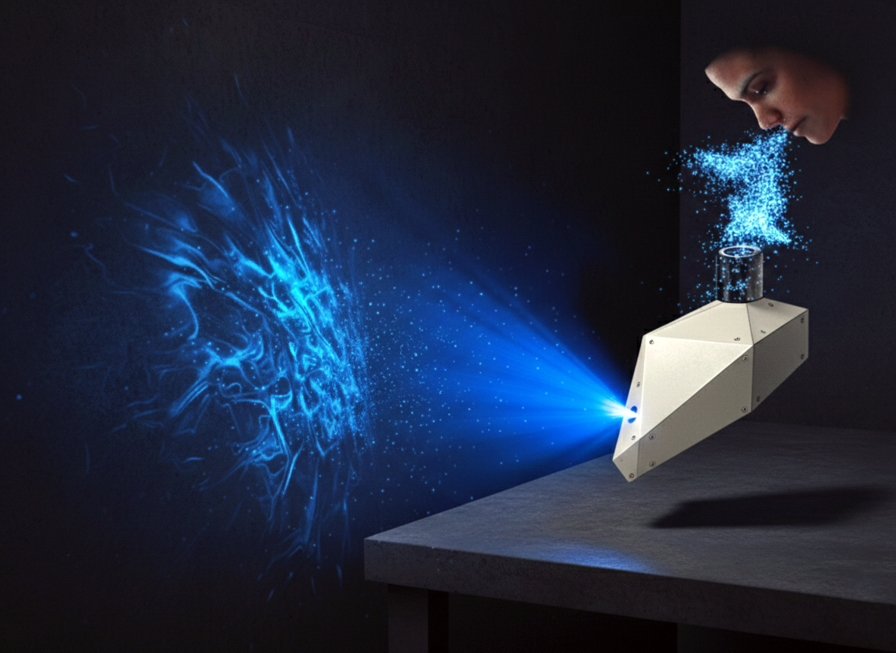
                    

                        [AFFECTIVE COMPUTING / HOLOGRAPHY]
                        <h3 class="p-title" id="pj-11-t">FLOQ BOX</h3>
                        

                            The Flow Box is inspired by the concept of "fluidity" in the modern world and explores human emotions. The device uses Affective Computing technologies to recognize the user's emotions, which it then metabolizes and represents through holographic simulation. With industrial materials (PVC, metal) and sharp geometries, the Flow Box is not just a box, but a communication channel between the subconscious and visual representation, transforming unboxing into a deeply personal, experiential experience.
                        

                        →
                    

                

            

        </section>

        <section id="art">
            08 // ART PORTFOLIO
            

                

                    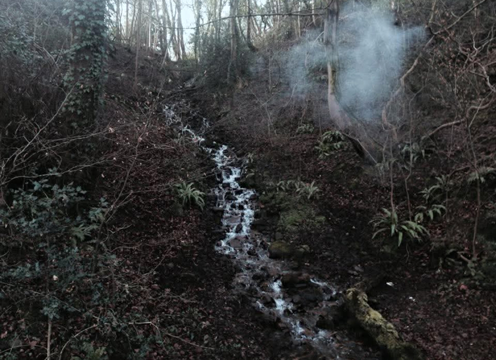
                    

                        [PHOTOGRAPHY]
                        <h3 class="p-title" id="art-1-t">Flow in the Forest</h3>
                        
Landscape composition with running water and atmospheric fog. A study on nature's textures and forest light.

                        →
                    

                

                

                    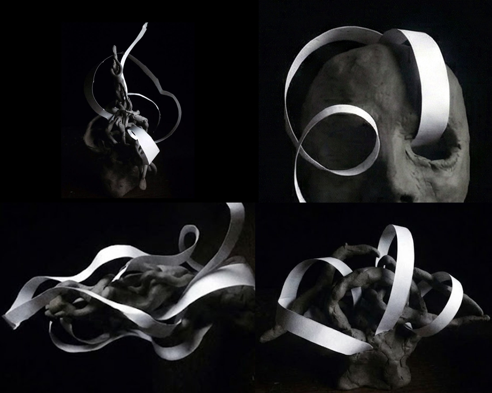
                    

                        [MIXED MEDIA / SCULPTURE]
                        <h3 class="p-title" id="art-2-t">Matter and Motion</h3>
                        
Mixed technique with clay and paper strips. The contrast between the solidity of the base and the lightness of geometric lines.

                        →
                    

                

                

                    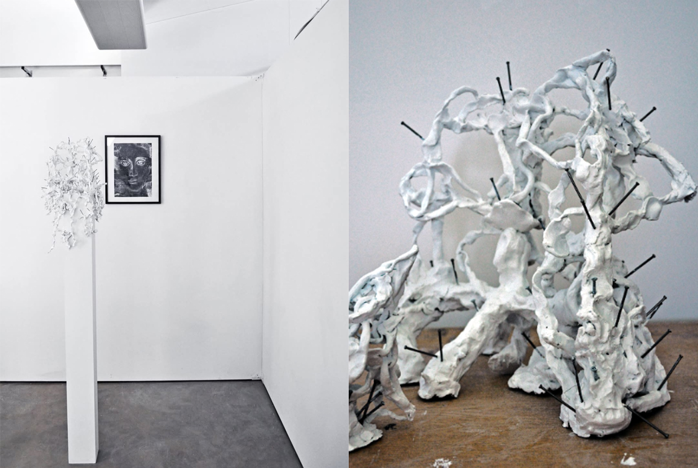
                    

                        [INSTALLATION]
                        <h3 class="p-title" id="art-3-t">Symbols and Matter</h3>
                        
Spatial installation. Clay with metal elements in dialogue with traditional iconography, exploring memory and decay.

                        →
                    

                

                

                    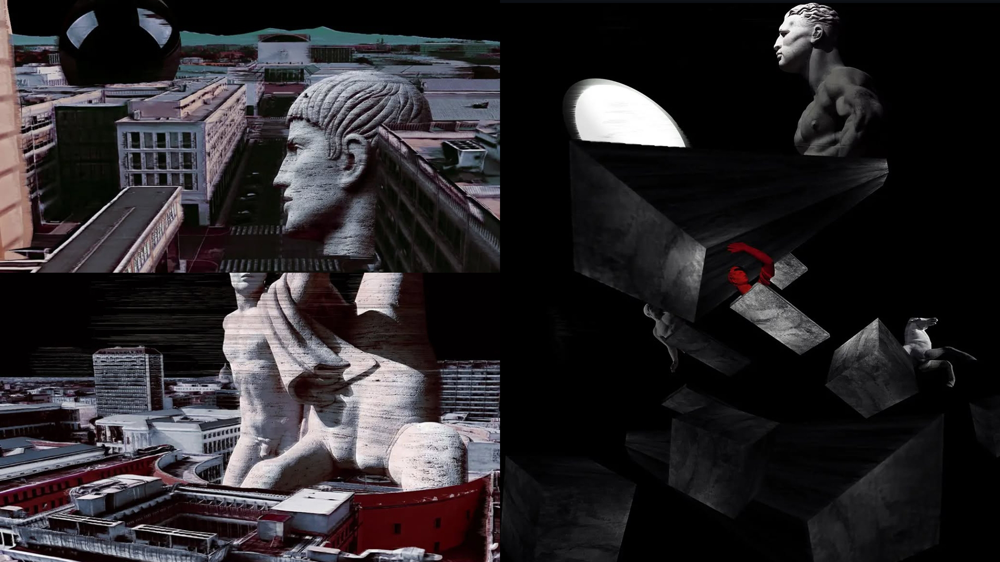
                    

                        [DIGITAL ART]
                        <h3 class="p-title" id="art-4-t">Urban Fragments</h3>
                        
Series of three digital compositions. Classical sculpture integrated into a deconstructed urban environment with intense color contrasts.

                        →
                    

                

                

                    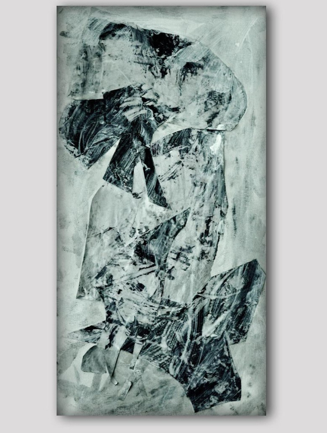
                    

                        [ABSTRACT / PAINTING]
                        <h3 class="p-title" id="art-5-t">Abstract 1</h3>
                        
Abstract composition on paper. Focusing on the dynamic movement of black color and the intensity of contrast with the white background.

                        →
                    

                

                

                    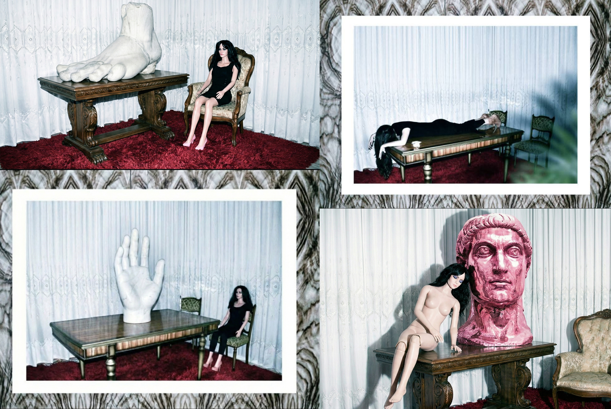
                    

                        [STAGED PHOTOGRAPHY]
                        <h3 class="p-title" id="art-6-t">Uncanny</h3>
                        
Photographic record of a human figure in a state of stillness within a classic domestic environment.

                        →
                    

                

                

                    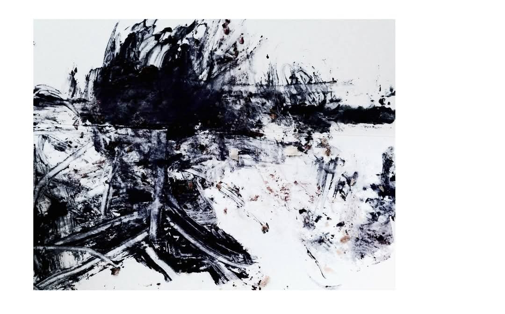
                    

                        [ABSTRACT / INK]
                        <h3 class="p-title" id="art-7-t">Abstract 2</h3>
                        
An evolution of the gesture series, exploring fluid dynamics and ink dispersion on textured paper.

                        →
                    

                

                

                    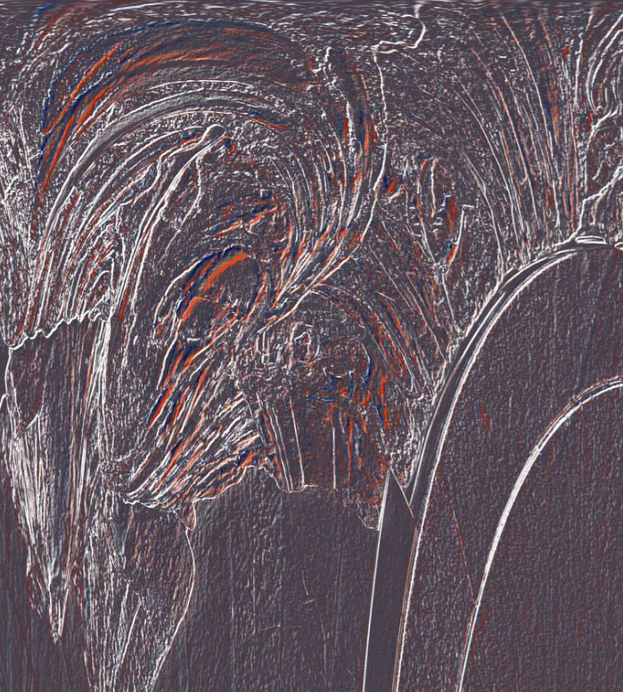
                    

                        [DIGITAL / ABSTRACT]
                        <h3 class="p-title" id="art-8-t">Chrome & Void</h3>
                        
Digital abstraction focusing on metallic surfaces and the absence of light in virtual spaces.

                        →
                    

                

            

        </section>

        <section id="projects">
            08 // FUNDED RESEARCH PROJECTS
            

                
EU / CEF

                

                    BYZART - Byzantine Art and Archaeology
                    
                        Creation of a thematic channel for the Europeana platform.
                        <a href="https://pro.europeana.eu/project/byzantine-art-and-archaeology" target="_blank" class="pub-link">[VIEW PROJECT]</a>
                    
                

            

        </section>
        <section id="publications">
            09 // SELECTED PUBLICATIONS
            

                
2025

                

                    Reimagining the Erasmus+ Experience through the Metaverse Erasmus Hub
                    Panagiotakopoulos et al. In NiDS 2025. <a href="https://link.springer.com/chapter/10.1007/978-3-032-10824-1_17" target="_blank" class="pub-link">[Springer]</a>
                

            

            

                
2025

                

                    APPLICATION OF RENEWABLE ENERGY EFFICIENCY TECHNOLOGIES FOR SUSTAINABLE URBAN DEVELOPMENT
                    Cheirchanteri, Tzortzi, Panagiotakopoulos, Papakitsos. WJERT Vol 10.0. <a href="https://www.researchgate.net/publication/396270478_APPLICATION_OF_RENEWABLE_ENERGY_EFFICIENCY_TECHNOLOGIES_FOR_SUSTAINABLE_URBAN_DEVELOPMENT_THE_CASE_OF_IOANNINA_GREECE_Original_Article_SJIF_Impact_Factor_7029_Corresponding_Author" target="_blank" class="pub-link">[WJERT]</a>
                

            

            

                
2025

                

                    Housing Crisis and Digital Worlds: The Potential of the Metaverse in Shaping Practices
                    Panagiotakopoulos, Cheirchanteri. Housing in Crisis Conference. <a href="https://www.researchgate.net/publication/398587539_HOUSING_CRISIS_AND_DIGITAL_WORLDS_THE_POTENTIAL_OF_THE_METAVERSE_IN_SHAPING_PRACTICES" target="_blank" class="pub-link">[VIEW]</a>
                

            

            

                
2025

                

                    Participatory Design as a Tool for Inclusive and Ethical Metaverse
                    Panagiotakopoulos et al. Cumulus Conference 2025. <a href="https://www.researchgate.net/publication/398079015_Participatory_Design_as_a_Tool_for_Inclusive_and_Ethical_Metaverse" target="_blank" class="pub-link">[VIEW]</a>
                

            

            

                
2025

                

                    The renewable energy sources (RES) efficiency energy technologies: A proposal for the city of Ioannina
                    Cheirchanteri, Tzortzi, Panagiotakopoulos. Eur. Conf. Ren. Energy Sys. <a href="https://www.researchgate.net/publication/394520201_The_renewable_energy_sources_RES_efficiency_energy_technologies_A_proposal_for_the_city_of_Ioannina_Greece" target="_blank" class="pub-link">[VIEW]</a>
                

            

            

                
2024

                

                    The Sensory Enrichment and Interactivity of Immersive User Experiences in the Public Sector
                    Deliyannis, Panagiotakopoulos et al. In Augmented and Virtual Reality in the Metaverse. <a href="https://link.springer.com/chapter/10.1007/978-3-031-57746-8_9?utm_source=researchgate.net&utm_medium=article" target="_blank" class="pub-link">[Springer]</a>
                

            

            

                
2024

                

                    The Metaverse in Art Education: A Deep Dive into Virtual Collaboration and Creativity
                    Deliyannis, Metzitakos, Panagiotakopoulos. DCAC 2024. <a href="https://www.researchgate.net/publication/380824491_The_Metaverse_in_Art_Education_A_Deep_Dive_into_Virtual_Collaboration_and_Creativity" target="_blank" class="pub-link">[VIEW]</a>
                

            

            

                
2024

                

                    Recycling and practices in the interdisciplinary field of Intelligent packaging
                    Mountzouri, Panagiotakopoulos et al. RETASTE Conference. <a href="https://www.researchgate.net/publication/391482261_Recycling_and_practices_in_the_interdisciplinary_field_of_Intelligent_packaging_Interaction_elements_of_urban_environment_and_metaverse" target="_blank" class="pub-link">[DOI]</a>
                

            

            

                
2022

                

                    Digital Scent Technology: Toward the Internet of Senses and the Metaverse
                    Panagiotakopoulos et al. In IT Professional, IEEE, Vol 24.0. <a href="https://www.researchgate.net/publication/360791503_Digital_Scent_Technology_Toward_the_Internet_of_Senses_and_the_Metaverse" target="_blank" class="pub-link">[IEEE]</a>
                

            

            

                
2022

                

                    Πρακτικά 6ου Επιστημονικού Συνεδρίου: Ευφυής Συσκευασία
                    Panagiotakopoulos (Editor). ISBN: 978-618-5690-02-1.
                

            

            

                
2021

                

                    Video Games as Technological Ruins of a Recent Past
                    Metzitakos, Panagiotakopoulos, Christodoulou. Design|Arts|Culture. <a href="https://ejournals.epublishing.ekt.gr/index.php/DAC/article/view/25904" target="_blank" class="pub-link">[Journal]</a>
                

            

            

                
2021

                

                    Intelligent ticket and its interaction with transmedia content
                    Panagiotakopoulos et al. Strategic Innovative Marketing and Tourism. <a href="https://www.researchgate.net/publication/349419331_Intelligent_Ticket_and_its_Interaction_with_Transmedia_Content_in_the_COVID-19_Smart_Tourism_Era" target="_blank" class="pub-link">[Springer]</a>
                

            

            

                
2021

                

                    AR and NFC Technologies in Smart Tourism Experience
                    Panagiotakopoulos, Christodoulou. Prospects for Development of Tourism. <a href="https://www.researchgate.net/publication/349861989_AR_and_NFC_Technologies_in_Smart_Tourism_Experience" target="_blank" class="pub-link">[VIEW]</a>
                

            

            

                
2021

                

                    Augmented Reality and Intelligent Packaging for Smart Tourism
                    Panagiotakopoulos et al. Augmented Reality in Tourism. <a href="https://www.researchgate.net/publication/346033618_Chapter_4_Augmented_Reality_and_Intelligent_Packaging_for_Smart_Tourism_A_Systematic_Review_and_Analysis" target="_blank" class="pub-link">[Springer]</a>
                

            

            

                
2020

                

                    Intelligent ticket with augmented reality applications
                    Panagiotakopoulos, Dimitrantzou. Strategic Innovative Marketing and Tourism. <a href="https://www.researchgate.net/publication/339802046_Intelligent_Ticket_with_Augmented_Reality_Applications_for_Archaeological_Sites" target="_blank" class="pub-link">[Springer]</a>
                

            

            

                
2020

                

                    Introducing Intelligent Ticket's Dual Role in Degraded Areas
                    Panagiotakopoulos. Gentrification & Crime. <a href="https://www.researchgate.net/publication/302974322_Transmedia_Perspectives" target="_blank" class="pub-link">[TU Delft]</a>
                

            

            

                
2020

                

                    Intelligent Urban Waste Management Systems. How Receptive Are We?
                    Konstantinou, Metzitakos, Nomikos, Panagiotakopoulos. University without Borders. <a href="https://www.researchgate.net/publication/389776194_Konstantinou_P_Metzitakos_R_Stathakis_G_Nomikos_S_and_Panagiotakopoulos_D_2021_Intelligent_Urban_Waste_Management_Systems_How_Receptive_Are_We_Journal_of_Economics_and_Business_Vol_4_No_1_pp_65-80_htt" target="_blank" class="pub-link">[VIEW]</a>
                

            

            

                
2020

                

                    Gentrification & Crime: New Configurations and Challenges for the City
                    Leoni... Panagiotakopoulos (Chapter). TU Delft OPEN Publishing. <a href="https://books.bk.tudelft.nl/press/catalog/book/gentrification-and-crime" target="_blank" class="pub-link">[TU Delft]</a>
                

            

        </section>
        <section id="activity">
            10 // ACADEMIC SERVICE & EDITORIAL ACTIVITY
            

                
2025 - Pres.

                

                    Editorial Board Member
                    <em>Modern Sciences and Sustainable Living (MSSL).</em> <a href="https://sciformat.ca/journals/index.php/mssl" target="_blank" class="pub-link">[Journal Website]</a>
                

            

            

                
2026

                

                    Peer Reviewer
                    Cumulus Athens 2026 Conference. Evaluation and comments on submitted articles.
                

            

            

                
2022

                

                    Publication Editor
                    <em>Proceedings of the 6th Scientific Conference: Intelligent Packaging.</em> ISBN: 978-618-5690-02-1.
                

            

        </section>
        <section id="talks">
            11 // INVITED TALKS
            

                
2024

                

                    Introduction to the Metaverse Phenomenon
                    14th Primary of Corfu, Scientific Project Partner of CulturePolis.
                

            

            

                
2021

                

                    Enhancing Experience in Intelligent Packaging
                    Syskevasia Virtual EXPO.
                

            

            

                
2016

                

                    From Reality to Digital (3D Survey)
                    University of Bologna & Minghetti High School.
                

            

        </section>
        <section id="languages">
            12 // LANGUAGES
            

                
Greek (Native), English (Fluent), Italian (Fluent).

            

        </section>
        <section id="contact">
            13 // CONTACT & LOCATION
            

                

                    "Feel free to reach out for research inquiries, collaborations, or student supervision. I am always open to discussing innovative projects and ideas."
                

            

            

                

                    <ul class="contact-list">
                        <li>
                            <strong id="c-1">Office</strong>
                            Room K16.102, Building K16 
                            Dept. of Graphic Design & Visual Communication
                        </li>
                        <li>
                            <strong id="c-2">Address</strong>
                            University of West Attica (Campus 1) 
                            Agiou Spyridonos Str, Egaleo 122 43 
                            Athens, Greece
                        </li>
                        <li>
                            <strong>Email</strong>
                            <a href="mailto:dpanagiotakopoulos@uniwa.gr" style="text-decoration: underline;">dpanagiotakopoulos@uniwa.gr</a>
                        </li>
                        <li>
                            <strong id="c-3">Hours</strong>
                            Monday - Thursday: 10:00 - 14:00 (By Appointment)
                        </li>
                    </ul>
                

                

                    <iframe
                        class="map-frame"
                        width="100%"
                        height="100%"
                        frameborder="0"
                        scrolling="no"
                        marginheight="0"
                        marginwidth="0"
                        src="https://maps.google.com/maps?q=University%20of%20West%20Attica%20Campus%201&t=&z=15&ie=UTF8&iwloc=&output=embed">
                    </iframe>
                

            

        </section>
    </main>
    <footer>
        
© 2026 DIMITRIS PANAGIOTAKOPOULOS. ACADEMIC PROFILE.

    </footer>

    
</body>
</html>
